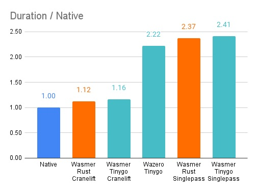

**Quicksort-100**

| Name                                | Environment              | Runs | ns/op      | vs. Native |
| ----------------------------------- | ------------------------ | ---- | ---------- | ---------- |
| NativeGoQuicksort-8                 | Native                   | 228  | 5168630    | 1.00       |
| RustQuicksort/wasmer/cranelift-8    | Wasmer Rust Cranelift    | 205  | 5781802    | 1.12       |
| TinygoQuicksort/wasmer/cranelift-8  | Wasmer Tinygo Cranelift  | 202  | 5998899    | 1.16       |
| TinygoQuicksort/wazero-8            | Wazero Tinygo            | 98   | 11498635   | 2.22       |
| RustQuicksort/wasmer/singlepass-8   | Wasmer Rust Singlepass   | 100  | 12261077   | 2.37       |
| TinygoQuicksort/wasmer/singlepass-8 | Wasmer Tinygo Singlepass | 100  | 12463634   | 2.41       |
| EVMQuicksort-8                      | EVM                      | 1    | 1825963651 | 353.28     |

